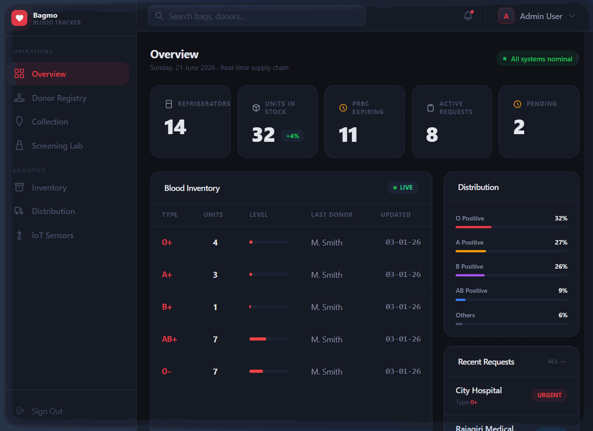

<div align="center">
  
  <h1>Smart Blood Bank Supply Chain</h1>
  <p><strong>An open-source reimplementation of the Bagmo blood logistics platform, built with Laravel 12 &amp; SQLite</strong></p>

  <p>
    
    
    
    
    
    
    
  </p>
</div>

---

> **⚠️ Disclaimer:** This project is a personal learning implementation inspired by **[Bagmo](https://bagmo.in)** — a real-world IoT medical logistics company focused on blood supply chain management. This is **not** an official product, not affiliated with Bagmo, and not a direct copy of their proprietary codebase. It recreates similar domain concepts (blood bags, RFID tracking, cold-chain IoT monitoring, FIFO dispatch) from scratch using open-source tools as a portfolio/learning project.

---

## Live Demo

> Full walkthrough through all 7 modules — recorded live from a running instance



---

## Inspiration

[Bagmo](https://bagmo.in) is an IoT medical logistics startup that builds real-time blood supply chain management systems for blood banks and hospitals across India. Their platform handles:

- RFID-tagged blood bag tracking from donation to dispatch
- Cold-chain temperature monitoring via IoT sensors
- Pathogen screening compliance and dispatch gating
- Multi-hospital blood request fulfilment

This project is a **ground-up reimplementation** of that domain using a standard Laravel + SQLite stack — intended as a portfolio project demonstrating backend architecture, IoT-adjacent API design, and multi-role application development. The UI design, code, and architecture are original.

---

## Overview

This is a full-stack, multi-role web application that models the complete lifecycle of blood units — from donor registration through pathogen screening, cold-chain IoT monitoring, and final dispatch to hospitals. Same problem domain as Bagmo, different implementation.

The system is built around three core technical concerns from the Bagmo domain:

| Concern | Implementation |
|---|---|
| **IoT Sensor Processing** | `POST /api/blood-bags/{rfid}/sensor-update` ingests temperature readings and flags breaches in real-time |
| **Compliance Validation** | Server-side dispatch gates preventing unsafe or unscreened blood bag release |
| **FIFO Stock Optimization** | Bags ordered by expiry date; oldest stock surfaced first for dispatch |

---

## Screenshots

| Dashboard Overview | Screening Lab |
|:---:|:---:|
|  |  |

| Inventory Management | IoT Sensor Monitoring |
|:---:|:---:|
|  |  |

| Distribution Dispatch | Blood Collection |
|:---:|:---:|
|  |  |

| Donor Registry |
|:---:|
|  |

---

## Features

### 🩸 Core Modules
- **Dashboard Overview** — Live KPI strip (stock, expiring bags, active requests), blood inventory table with bar-chart level indicators, blood group distribution, and PRBC expiry alerts with Reserve / Discard actions.
- **Donor Registry** — Full registration form with server-side validation, medical eligibility checklist, flash messages, and `old()` repopulation on errors.
- **Blood Collection** — Tracks live collection sessions with RFID tag assignment. "Details" modal shows donor vitals (pulse, BP, volume drawn).
- **Screening Lab** — Pathogen results table (HIV, HBsAg, HCV, Syphilis, Malaria) with visual pass/fail icons and bag-level status badges.
- **Inventory Management** — Per-blood-group stock cards with dynamic level bars. Cards turn red with a "Critical" badge when units fall below threshold.
- **Distribution** — Dispatch queue with Active / History tab toggle (Alpine.js). "New Dispatch" modal POSTs a validated request to the server.
- **IoT Sensors** — Live temperature monitoring grid for 8+ refrigerators with status-coded cards (Optimal / Warning / Breached). "Log →" modal shows per-unit temperature history.

### 🔐 Authentication & Authorization
- Laravel Breeze authentication (register, login, email verification, password reset).
- Custom `RoleMiddleware` enforcing `admin`, `hospital`, and `donor` roles on all routes.
- Database-seeded accounts for each role.

### 🏗 Architecture
- **MVC** — Business logic entirely in Controllers, zero logic in views or routes.
- **Eloquent ORM** — No raw SQL; all queries via model relationships.
- **Request Validation** — All inputs validated server-side before hitting the model layer.
- **REST API** — IoT sensor update endpoint for blood bag temperature ingestion.

---

## Tech Stack

| Layer | Technology |
|---|---|
| Framework | Laravel 12 (PHP 8.2+) |
| Database | SQLite (default, zero-config) |
| Frontend CSS | Tailwind CSS 3 with custom dark design system |
| Frontend JS | Alpine.js 3 (modals, tab toggles, flash dismissal) |
| Auth | Laravel Breeze |
| Build | Vite |

---

## Quick Start

### Prerequisites
- PHP 8.2+
- Composer
- Node.js 18+

### Installation

```bash
# 1. Clone the repository
git clone https://github.com/theadhithyankr/smart-blood-bank.git
cd smart-blood-bank

# 2. Install dependencies
composer install
npm install

# 3. Configure
cp .env.example .env
php artisan key:generate

# 4. Migrate & Seed
php artisan migrate --seed

# 5. Run (two terminals)
php artisan serve
npm run dev
```

Open **http://127.0.0.1:8000**

---

## Default Credentials

| Role | Email | Password |
|---|---|---|
| **Admin** | `admin@bloodbank.com` | `password` |
| **Hospital** | `hospital@bloodbank.com` | `password` |
| **Donor** | `donor@bloodbank.com` | `password` |

---

## API Reference

### Update Sensor Reading
```http
POST /api/blood-bags/{rfid}/sensor-update
Content-Type: application/json

{ "temperature_celsius": 4.2 }
```

**Response 200 — OK:**
```json
{
  "message": "Sensor data recorded.",
  "bag_rfid": "BB2026001",
  "status": "In Storage",
  "temperature_breached": false
}
```

**Response 422 — Temperature Breach:**
```json
{
  "message": "Temperature breach detected. Bag flagged.",
  "temperature_breached": true
}
```

---

## Project Structure

```
smart-blood-bank/
├── app/
│   ├── Http/
│   │   ├── Controllers/
│   │   │   ├── DashboardController.php      # All dashboard page logic
│   │   │   ├── BloodBagController.php        # FIFO dispatch API
│   │   │   ├── BloodBagActionController.php  # Reserve / Discard / Export
│   │   │   ├── AdminDonorController.php      # Donor registration
│   │   │   └── BloodRequestController.php    # Hospital requests
│   │   └── Middleware/
│   │       └── RoleMiddleware.php
│   └── Models/
│       ├── BloodBag.php
│       ├── BloodRequest.php
│       └── Donation.php
├── database/
│   ├── migrations/
│   └── seeders/
├── resources/
│   ├── css/app.css                          # Custom dark design system
│   └── views/dashboard/
│       ├── admin.blade.php
│       ├── inventory.blade.php
│       ├── testing.blade.php
│       ├── distribution.blade.php
│       ├── blood-collection.blade.php
│       ├── donor-registration.blade.php
│       └── temperature.blade.php
└── routes/
    ├── web.php
    └── api.php
```

---

## Design System

Custom dark-first token set extending Tailwind CSS:

| Token | Value | Role |
|---|---|---|
| `surface` | `#0f1117` | Page background |
| `surface.card` | `#171b26` | Panels & cards |
| `brand` | `#e63946` | Primary accent |
| `ink` | `#e8eaf0` | Primary text |
| `ok` | `#22c55e` | Success / safe |
| `warn` | `#f59e0b` | Warning states |
| `danger` | `#ef4444` | Critical / breach |

---

## Acknowledgements

- **[Bagmo](https://bagmo.in)** — the real product and company that inspired the domain model for this project.

---

## License

MIT © 2026 — Personal learning project. Not affiliated with Bagmo.
