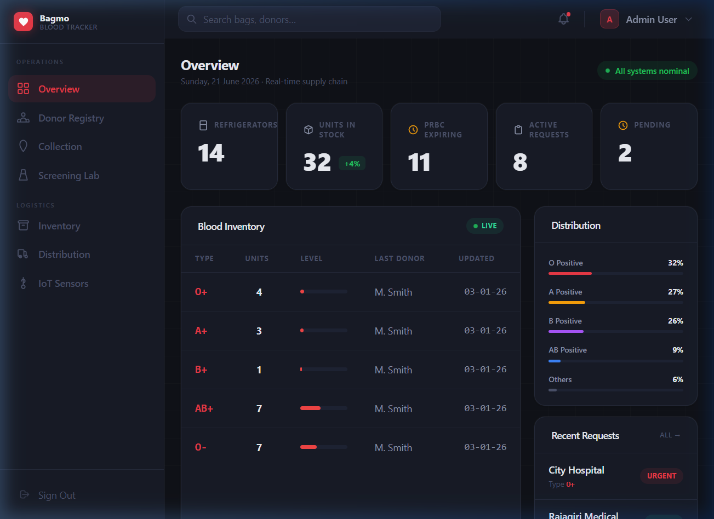
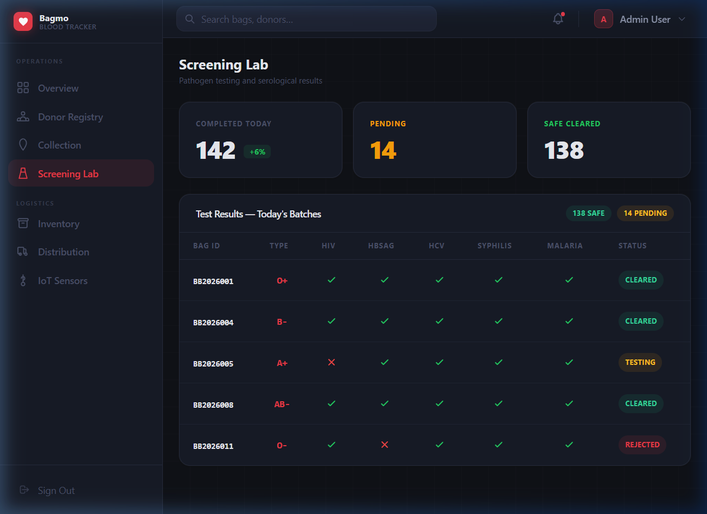
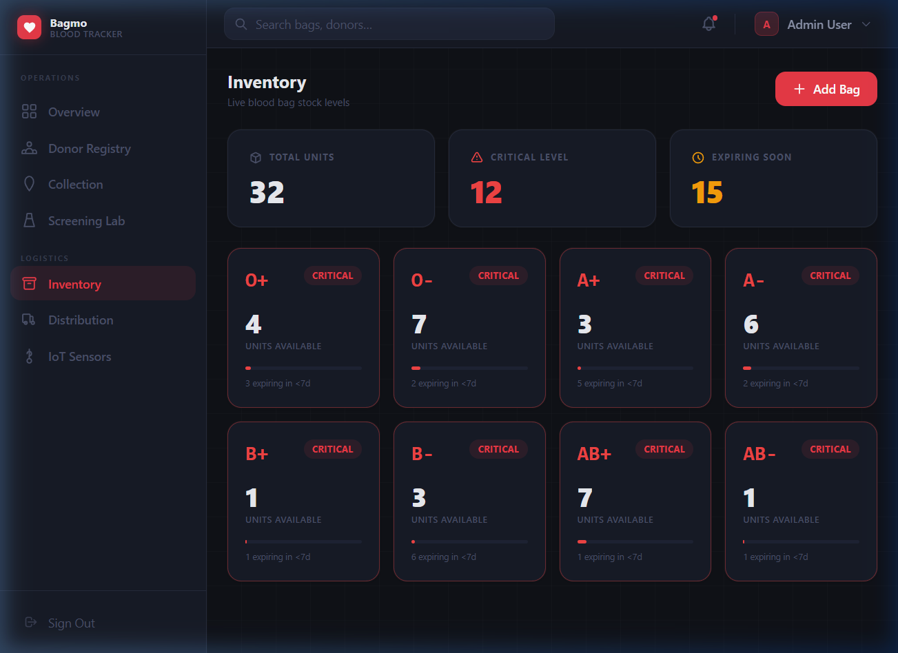
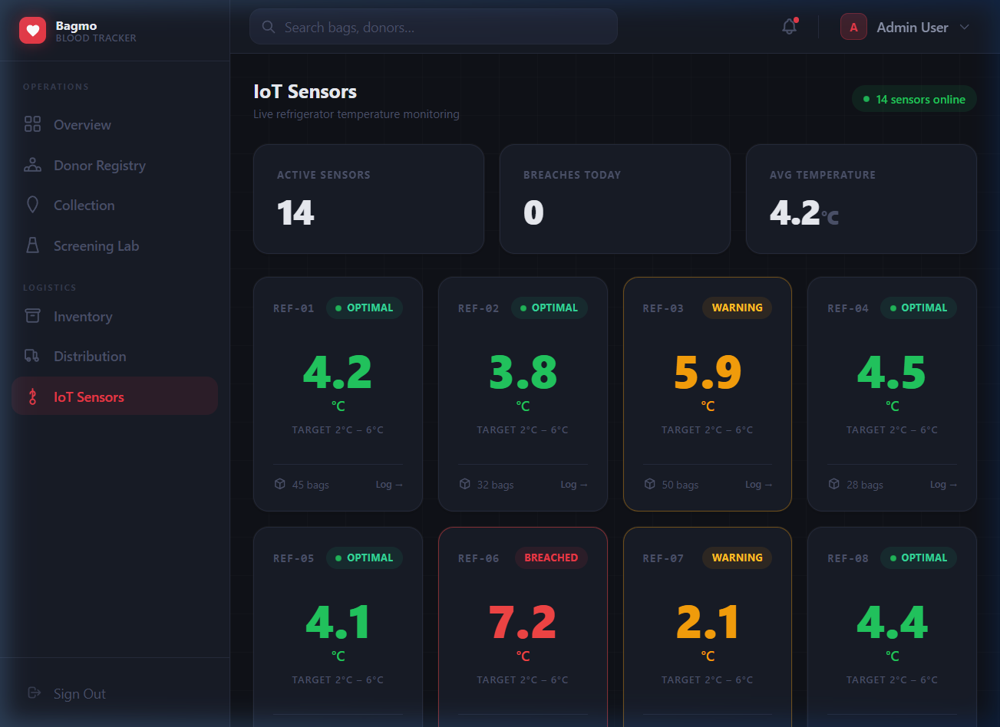
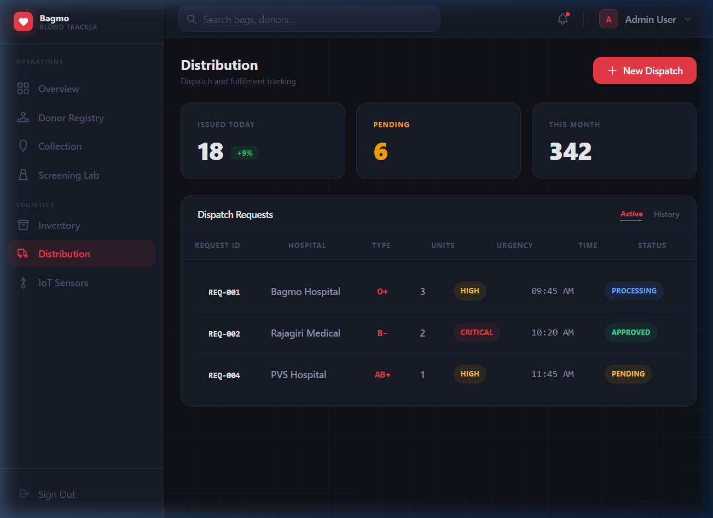
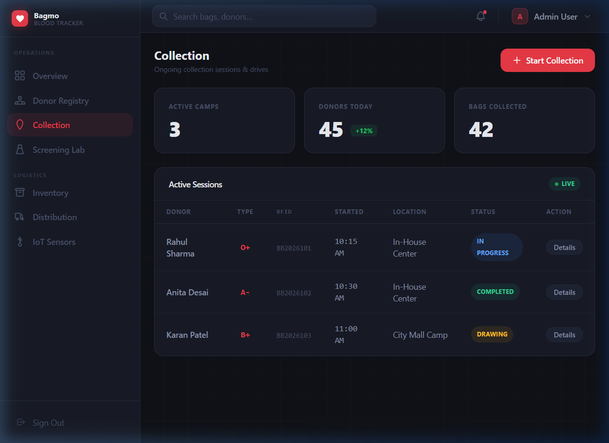
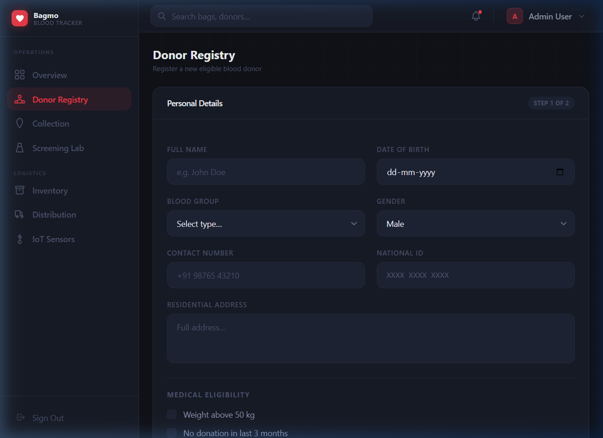

<div align="center">
  
  <h1>Bagmo — Smart Blood Bank Supply Chain</h1>
  <p><strong>A production-ready IoT medical logistics platform built with Laravel 12 &amp; SQLite</strong></p>

  <p>
    
    
    
    
    
    
  </p>
</div>

---

## Live Demo


> *Full navigation through all 7 modules — recorded live from a running instance.*

---

## Overview

**Bagmo** is a full-stack, multi-role web application that models the complete lifecycle of blood units in a modern blood bank supply chain — from donor registration through pathogen screening, cold-chain IoT monitoring, and final dispatch to hospitals.

The system is architected around three core technical concerns:

| Concern | Implementation |
|---|---|
| **IoT Sensor Processing** | Real-time temperature monitoring dashboard with per-refrigerator status (Optimal / Warning / Breached) |
| **Compliance Validation** | Server-side dispatch safety gates preventing unsafe blood bag release via Laravel validation |
| **FIFO Stock Optimization** | Blood bags ordered by expiry date; oldest bags surfaced first for dispatch |

---

## Screenshots

| Dashboard Overview | Screening Lab |
|:---:|:---:|
|  |  |

| Inventory Management | IoT Sensor Monitoring |
|:---:|:---:|
|  |  |

| Distribution Dispatch | Blood Collection |
|:---:|:---:|
|  |  |

| Donor Registry |
|:---:|
|  |

---

## Features

### 🩸 Core Modules
- **Dashboard Overview** — Live KPI strip (stock, expiring bags, active requests), blood inventory table with bar-chart level indicators, blood group distribution, and PRBC expiry alerts with Reserve / Discard actions.
- **Donor Registry** — Full registration form with server-side validation, medical eligibility checklist, flash messages, and `old()` repopulation on errors.
- **Blood Collection** — Tracks live collection sessions with RFID tag assignment. Inline "Details" modal shows donor vitals (pulse, BP, volume drawn).
- **Screening Lab** — Pathogen results table (HIV, HBsAg, HCV, Syphilis, Malaria) with visual pass/fail icons and bag-level status badges.
- **Inventory Management** — Per-blood-group stock cards with dynamic level bars. Cards turn red with a "Critical" badge when units fall below threshold.
- **Distribution** — Dispatch queue with Active / History tab toggle (Alpine.js). "New Dispatch" modal POSTs a validated request to the server.
- **IoT Sensors** — Live temperature grid for 8+ refrigerators with status-coded cards (green/amber/red). "Log →" modal shows the last 3 temperature readings per unit.

### 🔐 Authentication & Authorization
- Laravel Breeze-powered authentication (register, login, email verification, password reset).
- Custom `RoleMiddleware` enforcing `admin`, `hospital`, and `donor` roles on all routes.
- Database-seeded admin, hospital, and donor accounts.

### 🏗 Architecture
- **MVC** — Business logic entirely in Controllers, zero logic in views or routes.
- **Eloquent ORM** — No raw SQL; all queries via model relationships.
- **Request Validation** — All form inputs validated before hitting the model layer.
- **REST API** — BloodBag sensor update API (`POST /api/blood-bags/{rfid}/sensor-update`) for IoT device integration.

---

## Tech Stack

| Layer | Technology |
|---|---|
| Framework | Laravel 12 (PHP 8.2+) |
| Database | SQLite (default, zero-config) |
| Frontend CSS | Tailwind CSS 3 with custom design system |
| Frontend JS | Alpine.js 3 (modals, tab toggles, flash dismissal) |
| Auth | Laravel Breeze |
| Build | Vite |

---

## Quick Start

### Prerequisites
- PHP 8.2+
- Composer
- Node.js 18+

### Installation

```bash
# 1. Clone the repository
git clone https://github.com/your-username/smart-blood-bank.git
cd smart-blood-bank

# 2. Install PHP dependencies
composer install

# 3. Install Node dependencies
npm install

# 4. Copy environment file
cp .env.example .env

# 5. Generate application key
php artisan key:generate

# 6. Run database migrations and seed
php artisan migrate --seed

# 7. Start the development servers (two terminals)
php artisan serve
npm run dev
```

Then open **http://127.0.0.1:8000** in your browser.

---

## Default Credentials

| Role | Email | Password |
|---|---|---|
| **Admin** | `admin@bloodbank.com` | `password` |
| **Hospital** | `hospital@bloodbank.com` | `password` |
| **Donor** | `donor@bloodbank.com` | `password` |

---

## API Reference

The REST API is available for IoT device integration:

### Update Sensor Reading
```http
POST /api/blood-bags/{rfid}/sensor-update
Content-Type: application/json

{
  "temperature_celsius": 4.2
}
```

**Response 200 — OK:**
```json
{
  "message": "Sensor data recorded.",
  "bag_rfid": "BB2026001",
  "status": "In Storage",
  "temperature_breached": false
}
```

**Response 422 — Temperature Breach:**
```json
{
  "message": "Temperature breach detected. Bag flagged.",
  "temperature_breached": true
}
```

---

## Project Structure

```
smart-blood-bank/
├── app/
│   ├── Http/
│   │   ├── Controllers/
│   │   │   ├── DashboardController.php      # All dashboard page logic
│   │   │   ├── BloodBagController.php        # FIFO dispatch API
│   │   │   ├── BloodBagActionController.php  # Reserve / Discard / Export
│   │   │   ├── AdminDonorController.php      # Donor registration
│   │   │   └── BloodRequestController.php    # Hospital requests
│   │   └── Middleware/
│   │       └── RoleMiddleware.php
│   └── Models/
│       ├── BloodBag.php
│       ├── BloodRequest.php
│       └── Donation.php
├── database/
│   ├── migrations/
│   └── seeders/
│       └── UserSeeder.php
├── resources/
│   ├── css/app.css                          # Custom dark design system
│   └── views/
│       ├── layouts/
│       │   ├── app.blade.php
│       │   ├── sidebar.blade.php
│       │   └── navigation.blade.php
│       └── dashboard/
│           ├── admin.blade.php
│           ├── inventory.blade.php
│           ├── testing.blade.php
│           ├── distribution.blade.php
│           ├── blood-collection.blade.php
│           ├── donor-registration.blade.php
│           └── temperature.blade.php
└── routes/
    ├── web.php
    └── api.php
```

---

## Design System

The UI uses a **custom dark-first design system** built on top of Tailwind CSS with bespoke tokens:

| Token | Value | Purpose |
|---|---|---|
| `surface.DEFAULT` | `#0f1117` | Page background |
| `surface.card` | `#171b26` | Card / panel background |
| `surface.border` | `#252a3a` | Dividers and borders |
| `brand.DEFAULT` | `#e63946` | Primary accent (blood red) |
| `ink.DEFAULT` | `#e8eaf0` | Primary text |
| `ink.muted` | `#8b92a9` | Secondary text |

Custom component classes: `.stat-card`, `.panel`, `.badge`, `.btn-primary`, `.btn-ghost`, `.data-table`, `.nav-item`, `.form-input`.

---

## License

MIT © 2026 Bagmo Medical Logistics
